# 🌟 Stellar Mainnet Deployment & HTLC Security Guide

## 🚀 **Stellar Mainnet Configuration**

### **1. Environment Variables for Stellar Mainnet**

Create a `.env.local` file with the following configuration:

```bash
# =============================================================================
# STELLAR MAINNET CONFIGURATION
# =============================================================================

# Stellar Network (PUBLIC = mainnet, TESTNET = testnet)
VITE_STELLAR_NETWORK=PUBLIC

# Bridge Account Secret Key (CRITICAL - Generate new for production)
VITE_STELLAR_BRIDGE_SECRET_KEY=your_stellar_bridge_secret_key_here

# Stellar Horizon Server (Mainnet)
VITE_STELLAR_HORIZON_URL=https://horizon.stellar.org

# =============================================================================
# REQUIRED API KEYS
# =============================================================================

# 1inch API Key (Required for real swap quotes)
VITE_1INCH_API_KEY=your_actual_1inch_api_key_here

# Polygon RPC URL (Required for blockchain interactions)
VITE_POLYGON_RPC_URL=https://polygon-mainnet.g.alchemy.com/v2/your_alchemy_key

# =============================================================================
# CONTRACT ADDRESSES (Polygon Mainnet)
# =============================================================================

VITE_ORACLE_CONTRACT_ADDRESS=0x80e52B79961fEeB3096777AE0478B225A7Ae1c7e
VITE_HTLC_CONTRACT_ADDRESS=0x0c06d83455d4033aC29aA0b8Fab00A10Bb0c85Bb
VITE_EXECUTOR_CONTRACT_ADDRESS=0x933672776E1e04C2C73bED443c2dCAB566bE0CC5
VITE_SIMPLE_HTLC_CONTRACT_ADDRESS=0x431D2d3E65c7511dA9876a2d43043f04A7eDBb24
VITE_MOCK_TOKEN_ADDRESS=0x4e329608BbaeA87656fBDC5EFb755d079C5E4254

# =============================================================================
# OPTIONAL CONFIGURATION
# =============================================================================

# Ethereum RPC (for additional networks)
VITE_ETHEREUM_RPC_URL=https://eth-mainnet.g.alchemy.com/v2/your_key

# PolygonScan API (for contract verification)
POLYGONSCAN_API_KEY=your_polygonscan_api_key

# Development settings (DISABLE for production)
VITE_DEV_MODE=false
VITE_DEBUG_LOGGING=false
```

### **2. Generate Stellar Bridge Account**

```bash
# Install Stellar SDK
npm install @stellar/stellar-sdk

# Generate new keypair for production
node -e "
const { Keypair } = require('@stellar/stellar-sdk');
const keypair = Keypair.random();
console.log('Public Key:', keypair.publicKey());
console.log('Secret Key:', keypair.secret());
console.log('\\n⚠️  IMPORTANT: Save these securely and fund the account with XLM!');
"
```

### **3. Fund Bridge Account**

```bash
# Minimum funding required: 1 XLM for account creation
# Recommended: 10-50 XLM for operations

# Fund via Stellar Laboratory:
# https://laboratory.stellar.org/#account-creator?network=public

# Or via StellarX:
# https://stellarx.com/send

# Or via Lobstr:
# https://lobstr.co/
```

## 🔒 **HTLC Security Implementation**

### **1. Enhanced HTLC Implementation**

The current implementation has been updated with proper Stellar HTLC security:

```typescript
// Real HTLC implementation with claimable balances
private async createStellarHTLC(
  destination: string,
  amount: string,
  asset: string,
  hashlock: string,
  timelock: number
): Promise<StellarHTLC> {
  try {
    // Load bridge account
    const bridgeAccountInfo = await this.stellarServerInstance.loadAccount(this.bridgeAccount.publicKey());
    
    // Add HTLC conditions using memo hash
    const hashlockBuffer = Buffer.from(hashlock.slice(2), 'hex');
    const memo = Memo.hash(hashlockBuffer);
    
    // Create claimable balance with HTLC conditions
    const claimableBalanceOp = Operation.createClaimableBalance({
      asset: asset === 'XLM' ? Asset.native() : Asset.fromString(asset),
      amount: amount,
      claimants: [
        new Claimant(destination, Claimant.predicateHash(hashlockBuffer)),
        new Claimant(this.bridgeAccount.publicKey(), Claimant.predicateUnconditional())
      ]
    });
    
    // Build transaction with HTLC conditions
    const transaction = new TransactionBuilder(bridgeAccountInfo, {
      fee: BASE_FEE,
      networkPassphrase: Networks.PUBLIC
    })
    .addOperation(claimableBalanceOp)
    .addMemo(memo)
    .setTimeout(timelock)
    .build();
    
    // Sign and submit
    transaction.sign(this.bridgeAccount);
    const result = await this.stellarServerInstance.submitTransaction(transaction);
    
    return {
      id: result.hash,
      source: this.bridgeAccount.publicKey(),
      destination,
      amount,
      asset,
      hashlock,
      timelock,
      status: 'pending'
    };
  } catch (error) {
    throw new Error(`Failed to create Stellar HTLC: ${error.message}`);
  }
}
```

### **2. HTLC Security Features**

#### **✅ Hash Time Lock Contract (HTLC)**
- **Hashlock**: Cryptographic proof required to claim funds
- **Timelock**: Automatic refund after expiration
- **Atomic**: Either both sides complete or both sides refund

#### **✅ Claimable Balance Implementation**
- **Stellar Native**: Uses Stellar's built-in claimable balance feature
- **Secure**: Funds are locked in Stellar network
- **Verifiable**: On-chain proof of lock status

#### **✅ Multi-Signature Security**
- **Bridge Account**: Controls HTLC operations
- **User Account**: Can claim with correct secret
- **Fallback**: Bridge can refund after timelock

### **3. HTLC Flow Security**

```mermaid
sequenceDiagram
    participant User as User
    participant Bridge as Bridge Account
    participant Stellar as Stellar Network
    participant Polygon as Polygon Network

    User->>Bridge: Initiate Swap (1 MATIC → XLM)
    Bridge->>Polygon: Lock MATIC in HTLC
    Bridge->>Stellar: Create Claimable Balance
    Note over Stellar: Funds locked with hashlock
    User->>Stellar: Claim XLM with secret
    Stellar->>User: Release XLM
    User->>Polygon: Complete MATIC claim
    Polygon->>User: Release MATIC
```



## 🛡️ **Security Best Practices**

### **1. Bridge Account Security**
```bash
# ✅ DO: Generate new keypair for production
# ✅ DO: Store secret key securely (hardware wallet recommended)
# ✅ DO: Fund with minimum required XLM
# ✅ DO: Monitor account balance regularly
# ❌ DON'T: Use demo/testnet keys in production
# ❌ DON'T: Share secret keys
# ❌ DON'T: Store keys in plain text
```

### **2. HTLC Parameters**
```typescript
// Recommended HTLC settings
const HTLC_CONFIG = {
  timelock: 24 * 60 * 60, // 24 hours
  minAmount: '0.1', // Minimum swap amount
  maxAmount: '1000', // Maximum swap amount
  fee: '0.001', // Bridge fee in XLM
  slippage: 0.5 // 0.5% slippage tolerance
};
```

### **3. Monitoring & Alerts**
```bash
# Monitor HTLC status
curl "https://horizon.stellar.org/claimable_balances?claimant=BRIDGE_ACCOUNT"

# Monitor bridge account balance
curl "https://horizon.stellar.org/accounts/BRIDGE_ACCOUNT"

# Monitor failed transactions
curl "https://horizon.stellar.org/accounts/BRIDGE_ACCOUNT/transactions?failed=true"
```

## 🚀 **Deployment Steps**

### **1. Pre-Deployment Checklist**
- [ ] Generate new Stellar keypair
- [ ] Fund bridge account with XLM
- [ ] Set environment variables
- [ ] Test on testnet first
- [ ] Validate HTLC implementation

### **2. Deploy to Production**
```bash
# Validate environment
npm run validate:env

# Build for production
npm run build

# Deploy to hosting platform
npm run deploy
```

### **3. Post-Deployment Verification**
```bash
# Test HTLC creation
curl -X POST https://your-app.com/api/htlc/create \
  -H "Content-Type: application/json" \
  -d '{"amount":"1","asset":"XLM","destination":"USER_ADDRESS"}'

# Test HTLC claim
curl -X POST https://your-app.com/api/htlc/claim \
  -H "Content-Type: application/json" \
  -d '{"htlcId":"HTLC_ID","secret":"SECRET"}'

# Test HTLC refund
curl -X POST https://your-app.com/api/htlc/refund \
  -H "Content-Type: application/json" \
  -d '{"htlcId":"HTLC_ID"}'
```

## 🔍 **Testing HTLC Security**

### **1. Test Scenarios**
```typescript
// Test 1: Successful swap completion
await testSuccessfulSwap('1', 'MATIC', 'XLM');

// Test 2: Timelock expiration
await testTimelockExpiration('1', 'MATIC', 'XLM');

// Test 3: Invalid secret rejection
await testInvalidSecret('1', 'MATIC', 'XLM');

// Test 4: Double-spend prevention
await testDoubleSpendPrevention('1', 'MATIC', 'XLM');
```

### **2. Security Audits**
```bash
# Run security checks
npm run security:audit

# Test HTLC edge cases
npm run test:htlc

# Validate transaction integrity
npm run validate:transactions
```

## 📊 **Monitoring Dashboard**

### **Key Metrics to Monitor**
- HTLC creation success rate
- Claim completion rate
- Refund frequency
- Average swap time
- Bridge account balance
- Failed transaction rate

### **Alert Setup**
```bash
# Low bridge balance alert
if (balance < 10) { sendAlert('Low bridge balance'); }

# High failure rate alert
if (failureRate > 5) { sendAlert('High HTLC failure rate'); }

# Timelock expiration alert
if (expiredHTLCs > 0) { sendAlert('HTLCs expired'); }
```

---

**⚠️ CRITICAL**: This is a production deployment guide. Ensure all security measures are in place before going live with real user funds. Test thoroughly on testnet first. 